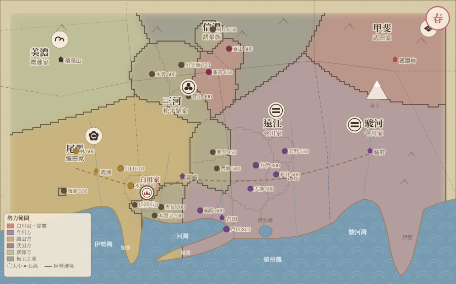
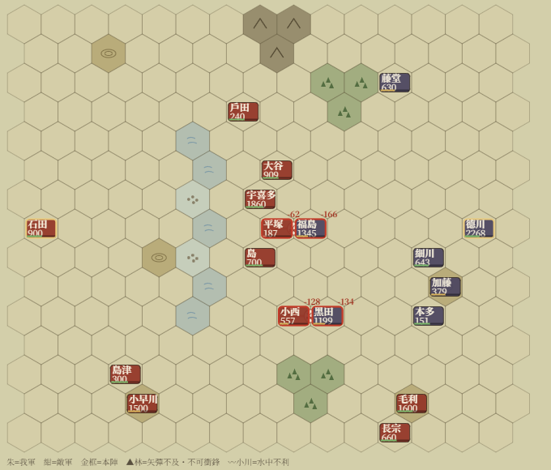

# 戰國家族記 — Sengoku Family Chronicle

> 亂世夾縫中的小豪族 — A small clan's saga through Japan's Warring States.

**▶ 立即遊玩 / Play now:** https://sengoku-sim-game-a5623.web.app
（單一 HTML 檔、無需安裝、支援手機平板 / single HTML file, no install, mobile-friendly）



## 中文簡介

天文十四年（1545），三河・尾張邊境。今川與織田的陰影下，你的家族要活下去。

《戰國家族記》是一款**單檔 HTML 的戰國小豪族經營模擬**。你不是大名——你是石高數百的國人眾當主，種田、練兵、嫁娶、依附強者、在大名之間選邊，把家族一代一代傳下去，最終或臣服、或下克上、或天下統一。

- **家族世代**：當主老去、子女元服、縁談與婿養子、隱居讓位、系譜樹記載歷代命運；絕嗣即終局
- **五種家業**：國人／商人／寺社／忍／水軍，各有專屬玩法、昇格路徑與戰場兵種（石火矢・亂波・僧兵・焙烙）
- **活的世界**：21 家史實國人眾各自經營（評定方針公開可見）、宿怨同盟聯姻；大名切り取り併吞、境目相論、包圍網——你不動，世界也在動
- **恩義與調略**：荒年售米、受降不殺都記在恩義帳上；戰場上可遣密使策反敵方與力（內應調略）
- **大名國戰・盤上指揮**：軍議→布陣→15×15 六角即時戰。時刻制（辰の刻開戰、日沒為限）、兵種相剋、騎馬衝鋒 vs 足輕槍衾、夾擊合圍、地形（丘・林・小川・渡口）、指名攻擊；與力備由 AI 自行節度——大將身先士卒則士卒用命
- **合戰體驗：關原の戰**：標題畫面直接參戰（不佔存檔）——扮演西軍大谷吉継（修羅）或東軍黑田長政（標準），史實佈陣（南宮山的毛利按兵不動、松尾山的小早川去就未明），小早川雙向去就：也許這一次，歷史在此改道
- **史實事件軸**：桶狹間（可拚死護駕開啟今川上洛 If 線）、本能寺、關原、大坂之陣等 17 事件＋京都風雲、德政災害、天正慶長地震



## English

**Sengoku Family Chronicle** is a single-file HTML strategy/management sim set in Japan's Warring States era (starting 1545). You are not a daimyō — you head a minor landed clan of a few hundred koku, caught between Imagawa and Oda. Farm, train, marry, swear fealty, switch sides, and carry your family through the generations — toward submission, gekokujō, or unification of the realm.

- **Generations**: heirs come of age, marriages and adopted sons-in-law, retirement and succession, a family tree recording every fate; the line dying out is game over
- **Five clan trades**: kokujin (warrior-landholder), merchant, temple, shinobi, and navy — each with its own playstyle, promotion path, and signature battlefield units
- **A living world**: 21 historical clans run their own multi-year plans (openly visible), with feuds, alliances and marriages among them; daimyō annex free clans and fight border wars — the world moves without you
- **Favor & subversion**: selling rice in famine or sparing the defeated is remembered in a ledger of obligation; before battle you may send a secret envoy to turn an enemy vassal contingent
- **Grand battles (Bangjō Shiki)**: war council → deployment → real-time 15×15 hex battles under a time-of-day clock (dawn to dusk). Weapon-type counters, cavalry charges vs. spear walls, flanking, terrain (hills, woods, streams, fords), named-target attacks; allied contingents act on their own morale — lead from the front and they fight harder
- **The Battle of Sekigahara**: playable from the title screen (no save slot needed) — command Ōtani Yoshitsugu (West, brutal) or Kuroda Nagamasa (East, standard) with historical deployment: Mōri sits idle on Mt. Nangū, and Kobayakawa on Mt. Matsuo may betray either side. Perhaps this time, history takes another road
- **17 historical events**: Okehazama (with an alternate "Imagawa marches on Kyōto" timeline if you save Yoshimoto), Honnō-ji, Sekigahara, Ōsaka, and more

## 語言 / Languages / 言語

介面支援**中文／English／日本語**——依瀏覽器語系自動選擇，也可在標題畫面右上角切換。翻譯採顯示層字典（遊戲邏輯不受語系影響），目前涵蓋標題、主介面與盤上指揮戰鬥全 UI；敘事事件文本漸進翻譯中。
UI available in **Chinese / English / Japanese** — auto-detected from your browser, switchable at the top of the title screen. Core UI and the hex-battle interface are fully covered; narrative event text is being translated progressively.

## 技術 / Tech

- **單一 HTML 檔（約 600KB）**，無框架無依賴：Canvas 2D 繪製地圖／戰場／程序化人物面孔，localStorage 四欄存檔（格式自 v1 起向後相容）
- **Balance by simulation**: a Node.js + DOM-shim harness (`_sim/`) replays hundreds of full campaigns per change — 0 errors / 0 audit violations is the release gate; battle win rates are calibrated with N≥300 sweeps (the Sekigahara 40% target alone took ~8,000 simulated battles)
- Hosting: Firebase

### 本地執行 / Run locally

```
# 任何靜態伺服器即可 / any static server works
python -m http.server 5877
# 開啟 / open  http://localhost:5877/index.html
```

手機同 Wi-Fi 遊玩：執行 `手機遊玩.bat`。 / For phones on the same Wi-Fi, run `手機遊玩.bat`.

### 開發文件 / Docs

完整系統設計見 [企劃書.md](企劃書.md)（中文，含 9 章系統詳述與平衡調參記錄）。

---

*Fan-made hobby project. 歷史人名與事件取材自史實，遊戲數值與演繹皆為虛構。*
